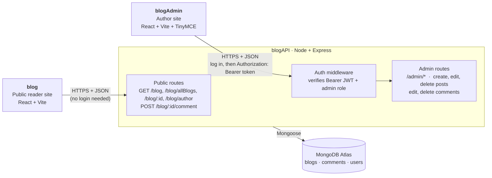

# Personal Blog

The **public reader site** of a three-app blog: a responsive, accessible front end built with **React 18, React Router 6 and Vite** for reading posts and leaving comments.

| App | Role | Default dev URL |
| --- | --- | --- |
| `blogAPI` | Express + MongoDB REST API | http://localhost:3005 |
| `blog` (this repo) | Public site: read and comment | http://localhost:5173 |
| `blogAdmin` | Author site: write, publish, moderate | http://localhost:5174 |

## Features

- **Home, all-posts and single-post pages** with newest-first ordering, reading-time estimates and generated gradient thumbnails.
- **Live search** across post titles and body text.
- **Deep-linkable posts** (`/blog/:id` loads its own data, so refreshes and shared links work).
- **Comments** with validation, pending/error states and automatic refresh after posting.
- **Author profile** (name, GitHub/LinkedIn) loaded from the API for the nav, footer and page titles, edited in blogAdmin.
- **Light and dark themes** that follow the OS setting, keyboard-friendly navigation, skip link and reduced-motion support.
- **Safe HTML rendering**: post bodies are entity-decoded and sanitized with DOMPurify before display.

## Tech stack

React 18 · React Router 6 (data router) · Vite 5 · SCSS · DOMPurify · html-entities · Vitest + Testing Library · ESLint

## Getting started

```bash
npm install
cp .env.example .env    # then adjust if your API is not on localhost:3005
npm run dev             # http://localhost:5173 (start blogAPI first)
```

| Script | What it does |
| --- | --- |
| `npm run dev` | Start the Vite dev server with HMR |
| `npm run build` | Production build into `dist/` |
| `npm run preview` / `npm start` | Serve the production build |
| `npm test` | Run the test suite once (`npm run test:watch` to watch) |
| `npm run lint` | ESLint with zero warnings allowed |

### Configuration

| Variable | Default | Purpose |
| --- | --- | --- |
| `VITE_API_URL` | `http://localhost:3005` | Base URL of the blog API |
| `VITE_ADMIN_URL` | _(unset)_ | If set, the footer shows an "Admin" link to the blogAdmin site |

### API used

All public, no authentication. The API must list this site's origin in its `CORS_ORIGINS`.

| Method & path | Used for |
| --- | --- |
| `GET /blog` | Latest 4 posts (home page) |
| `GET /blog/allBlogs` | All published posts |
| `GET /blog/:id` | `{ blog, comments }`; `404` for unknown ids and drafts |
| `POST /blog/:id/comment` | Add a comment `{ user, message }` (2–40 / 2–1000 chars) |
| `GET /blog/author` | Public profile of the blog author (home page, nav, footer) |

## Project structure

```
src/
  components/   Layout, PostCard, PostList, Comments, SearchBar, Status, ...
  context/      AuthorProvider (loads the author profile once)
  pages/        Home, AllBlogs, Blog, NotFound
  hooks/        useFetch (abortable data loading), useDocumentTitle, useAuthor
  lib/          api.js (fetch wrapper + typed errors), format.js (dates, sanitizing, excerpts)
  styles/       main.scss (design tokens, light/dark themes, components)
  router.jsx    Route table, shared by the app and the tests
tests/          Vitest suites for helpers and full page flows
```

## Skills demonstrated

**Front-end engineering**
- Structuring a React app around a data router with nested layouts, dynamic segments, route-level error/404 handling and lazy-loaded routes.
- Writing reusable hooks (`useFetch` with `AbortController` cancellation and reload) instead of scattering `useEffect` fetches through components.
- Managing loading, empty, error and retry states for every network call.

**Security and reliability**
- Preventing XSS when rendering stored HTML by sanitizing with DOMPurify (with a regression test).
- A single API client with consistent error handling instead of unhandled promise rejections.

**UX, accessibility and design**
- Semantic HTML, labelled form controls, `role="alert"`/`role="status"` announcements, visible focus, skip link and `prefers-reduced-motion`.
- A design-token system in SCSS/CSS custom properties with automatic dark mode and a mobile-first responsive layout.

**Testing and tooling**
- Integration-style tests with Vitest, Testing Library and a mocked `fetch`, covering routing, search, deep links, error states and form validation.
- Vite configuration, environment variables, ESLint rules for React hooks and refresh, and a production build workflow.

**Full-stack architecture**
- Splitting one product into an API and two independent front ends (reader and admin) that talk to the same REST API, with CORS and Bearer-token auth handled on the API side.



- **Two front ends, one API.** The reader site only calls public routes. The admin site logs in with a username and password, receives a JWT, stores it in `localStorage`, and sends it as `Authorization: Bearer <token>` on every request.
- **The API is the only thing that touches the database** and is the source of truth for permissions: the front ends only hide or show controls, and every protected route re-checks the token and admin role.
- **CORS** lists each front end's origin, so the apps can be deployed to different hosts and still share the API.

**Refactoring legacy code**
- Started as a tutorial-style prototype (router rebuilt on every render, data fetched globally, post view dependent on router state, dead code, non-working tests) and rebuilt into the structure above.

## Roadmap

- Rich-text/Markdown editor with live preview
- Pagination and tags
- Deploy pipeline (CI for lint, test and build)
